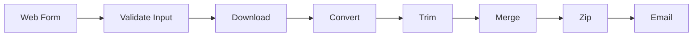

# 🎵 YouTube Mashup Generator

A full-stack Python application that:
Downloads N YouTube videos of a given singer
Converts them to audio
Extracts first Y seconds from each
Merges them into a single mashup
Sends the mashup as a ZIP file via email

Built using:

Python 3.12

yt-dlp

MoviePy (1.0.3)

Pydub

Streamlit

# 📌 Features

✔ Command-line version (Program 1)

✔ Web-based Streamlit interface (Program 2)

✔ Email delivery with ZIP attachment

✔ Input validation

✔ Clean workspace handling

✔ Custom UI with gradient background

✔ Modular function design

# 🛠 Tech Stack 

| Tool       | Purpose                      |
|------------|-----------------------------|
| Python     | Core programming language   |
| yt-dlp     | Download YouTube videos     |
| MoviePy    | Convert video to audio      |
| Pydub      | Trim and merge audio        |
| Streamlit  | Web interface               |

# Command Line Version
python 102317228.py "Name of Singer" Number of songs duration of each clip output.mp3

#🌐 Program 2 — Streamlit Web Version
streamlit run app.py
http://localhost:8501

# 🔄 CLI Workflow

# 📦 Web App Workflow

# 📊 Folder Data Flow

# 🔐 Email Delivery Process

# 🎉 Final Outcome
The application successfully:

Downloads content from YouTube

Processes audio

Generates mashup

Provides CLI interface

Provides Web interface

Sends mashup via email

# 👨‍💻 Author

## Name :Sparsh Gupta
Roll Number: 102317228
Course: Python Programming
Assignment: YouTube Mashup Generator

